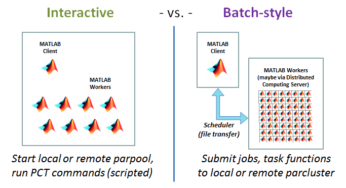
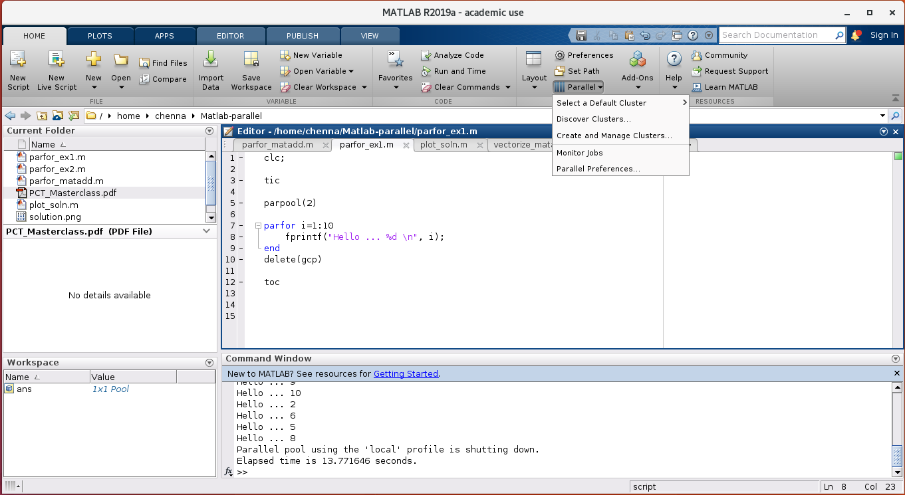
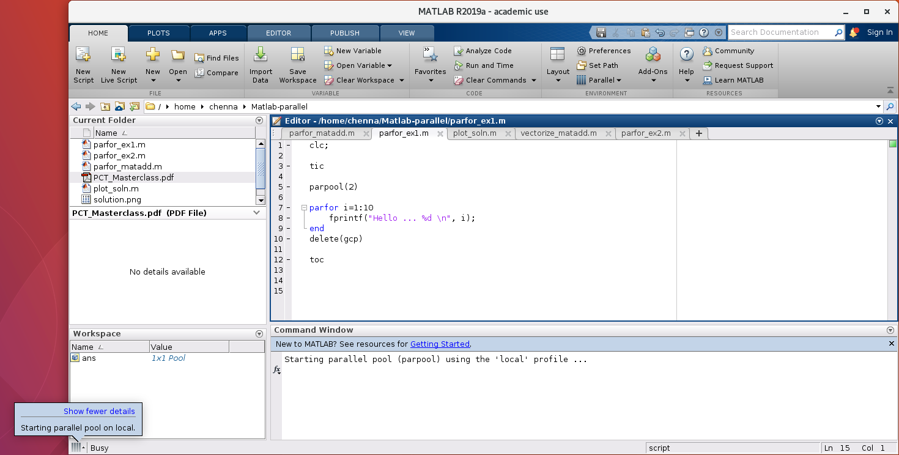

# Parallel Computing support in MATLAB

>## What does [MATLAB](https://uk.mathworks.com/products/parallel-computing/parallel-support.html) say?
>A growing number of functions, System objects™, and features
in several MATLAB® and Simulink® products offer the ability to
take advantage of parallel computing resources without
requiring any extra coding. We can enable this support by
simply setting a flag or preference. To take advantage of this
functionality on our desktop, we need **Parallel Computing Toolbox™**.
To scale the parallel computing support to larger resources
such as computer clusters, we also need **MATLAB Parallel Server™**.
{: .callout}

### MATLAB Parallel Computing Toolbox (PCT)
* The MATLAB Parallel Computing Toolbox supports you in
  parallelising your MATLAB code to take advantage
  of multiple CPUs and GPUs.
* MATLAB's high-level constructs such as parallel for-loops,
  parallel function evaluators, distributed arrays, and
  parallelised numerical algorithms for linear algebra and
  differential equations help you harness the power of
  supercomputers by using the same code on both your
  personal computer and the supercomputer. (Still requires some
  effort, though. Remember, there are no free lunches).

#### MATLAB Parallel Computing Toolbox terminology
Throughout this course, we will using several terms related to
the MATLAB Parallel Computing Toolbox. Some important terms in
MATLAB Parallel Computing Toolbox that we use and learn in this
course are:

:-----------------|:-----------------------------------------
* **Cluster**     | The (remote) high-performance computing machine.
* **Client**      | The head MATLAB session; it creates workers, distributes work and gathers results.
* **Worker**      | A single computing unit, typically a CPU core on HPC machines.
* **Interactive** | The mode of working using the desktop environment (GUI).
* **Batch-style** | The mode of working using scripts, without the GUI.
* **parpool**     | Short for parallel pool. Refers to a group of workers. A parallel pool can be either local or remote.
* **gcp**         | Short for "Get the Current Pool" Returns a `parallel.Pool` object.
* **labindex**    | Rank of the worker in the active parallel pool. `Starts from 1`.
* **numlabs**     | Total number of workers in the active parallel pool.
* **spmd**        | Short for the parallel programming construct *Single Program Multiple Data*.
* **parfor**      | Parallel for-loop.
* **parfeval**    | Parallel function evaluator.
* **pmode**       | Interactive Command Window for Parallel Computing.
* **mpiprofile**  | MATLAB's profiler for parallel code.

### MATLAB Parallel Server
* All the aspects of licensing on the cluster-side are
  handled by the MATLAB Parallel Server which was known in the past as the
  MATLAB Distributed Computing Server (MDCS).
* MATLAB Parallel Server offloads our MATLAB jobs to
  HPC machines to take advantage of multiple CPUs and GPUs, as depicted
  in the image below.
* It supports batch jobs, interactive parallel computations
  and distributed computations with large matrices.

|  |
|:--:|
| Image credit: <https://www.cac.cornell.edu/wiki/index.php?title=Tutorial:_Using_MATLAB_PCT_and_MDCS_in_Red_Cloud> |

> ## MATLAB's job Scheduler
> * MATLAB PCT comes with a built-in job scheduler
which can be used to distribute and manage parallel jobs
among the workers in a parallel pool. However, we don't
know how this interacts with the HPC cluster, especially
when used in combination with the HPC cluster's job schedulers
such as SLURM which is used on Supercomputing Wales (SCW) clusters.
> * Therefore, use of MATLAB's job scheduler `is not
recommended` for use on SCW clusters.
{: .callout}

## parpool
The **parpool** function starts a parallel pool of workers
(also called as labs) to run the job. The basic syntax
for using **parpool** is:

~~~
parpool(2)
%
% some parallel tasks here
%
delete(gcp)
~~~
{: .language-matlab}

The above code starts a parallel pool with two workers,
performs some parallel tasks, if any, and deletes the instance
of the currently active parallel. The function call `delete(gcp)`
shuts down the parallel pool before deleting the parallel pool object.

By default, the parallel pool is created using the "local" profile,
meaning that `parpool(2)` is the same as `parpool('local', 2)`.

A parallel pool with other profiles, and with different numbers of
workers, can be initialised by using:
~~~
parpool('myProfile', 10)
~~~
{: .language-matlab}

We can also start a parallel pool with the workers on a
remote cluster by using:
~~~
clus = parcluster;
parpool(clus)
~~~
{: .language-matlab}

If we are running MATLAB in interactive mode,
we can change the parallel pool option by accessing the `Parallel` icon
in the `Home` tab:

Once the job has started, we can check the parallel pool status by
clicking on the pool status indicator at the lower-left corner of
the MATLAB desktop window:

## What happens when we execute the **parpool** command?
To understand what happens when we use the **parpool** command,
let us run following code:

~~~
parpool(2)

parfor i=1:6
   fprintf("Hello ... %d \n", i)
end

delete(gcp)
~~~
{: .language-matlab}

~~~
Starting parallel pool (parpool) using the 'local' profile ...
Connected to the parallel pool (number of workers: 2).

ans =

 Pool with parameters:

           Connected: true
          NumWorkers: 2
             Cluster: lolcal
       AttachedFiles: {}
   AutoAddClientPath: true
         IdleTimeout: 30 minutes (30 minutes remaining)
         SpmdEnabled: true

Hello ... 1
Hello ... 3
Hello ... 5
Hello ... 2
Hello ... 4
Hello ... 6

Parallel pool using the 'local' profile is shutting down.
~~~
{: .output}

When `parpool` is executed, MATLAB's PCT starts a parallel pool
with the specified profile and number of workers. We can see this information
in the output screen.

>## parpool - some caveats
>* MATLAB allows only one instance of an active parallel pool at any given time.
If we want to change the profile or the number of workers (or both),
we have to shutdown the existing parallel pool first using `delete(gcp)`.
>* MATLAB takes some time to start a parallel pool. So, the first run
using a parallel tool/function is always slower because of the overhead
in starting the parallel pool. The overhead can be significant when
running multiple jobs.
>* We can check if a parallel pool is active using `gcp('nocreate')`.
>* The number of workers requested should not be more than that
specified in the profile preferences. If we request more workers than
those specified in the profile, MATLAB throws an error.
{: .callout}

> ## matlabpool
> You may come across `matlabpool` if you browse internet for MATLAB PCT.
> `matlabpool` is the name used before R2013b. From R2013b onwards,
> `matlabpool` has been replaced with `parpool`.
{: .callout}

> ## Exercise on **parpool**
> Execute `gcp` on the command line to understand its behaviour
> with different options. Experiment with:
> * `p=gcp`
> * `delete(p)`
> * `p=gcp('nocreate')`
> * `isempty(p)`
{: .challenge}

## parfor Vs spmd
**parfor** and **spmd** are two of the most important
constructs in the MATLAB PCT. You will learn them in a later part
of this course. Before delving into the details of **parfor** and
**spmd**, let's have a brief overview of them.
* As the name suggests **parfor** is the parallel for-loop.
   * **parfor** distributes the loop iterations among the workers.
* **spmd** refers to **s**ingle **p**rogram **m**ultiple **d**ata
  construct in the esoteric language of parallel computing.
   * **spmd** is a parallel region and offers much more flexibility
     in writing parallel codes.
   * The statement(s) inside the **spmd** construct are, by default,
      executed on all the workers.
* The fundamental difference between **spmd** and **parfor** is the
  communication between the workers in the pool. While **spmd** allows
  a clear way of communicating between the workers, communication
  in **parfor** is a mystery.

To understand the differences between **parfor** and **spmd**,
let us do the following exercise:

> ## Exercise on **parfor** and **spmd**
> ~~~
> clc;
> parpool(2);
> parfor i=1:6
>    t = getCurrentTask();
>    fprintf("Hello ... %d \n", t.ID)
> end
>
> spmd
>    fprintf("Hello ... %d \n", labindex)
> end
> ~~~
> {: .language-matlab}
{: .challenge}


