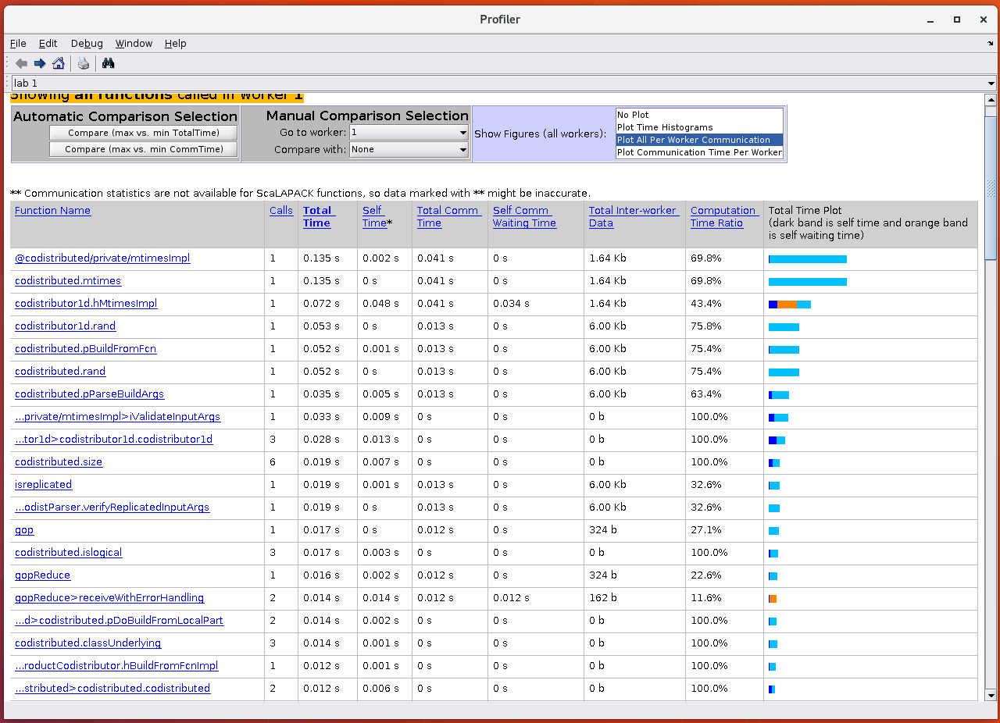
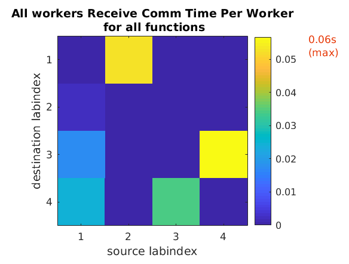

## Profiling the parallel code - `mpiprofile`
Profiling parallel code in MATLAB is similar to profiling
serial code. For profiling parallel code, we have to use the
`mpiprofile` command. The difference between using the standard
`profile` and `mpiprofile` commands is in where they are called.

Similar to the serial profiler, `mpiprofile` can be used from
either the command prompt (`pmode`) or within the MATLAB script.
For interactive usage, `mpiprofile` should be called from the
parallel command window (**pmode**).

Open the **pmode** and enter the following commands at the **pmode** 
command prompt.

~~~
P>> mpiprofile on
P>> distobj = codistributor('1d',1);
P>> A = rand(10, distobj);
P>> B = A*A;
P>> mpiprofile viewer
~~~
{: .language-matlab}

Once we execute `mpiprofile viewer` command in the **pmode**,
it will open a new window with the profiling data. Clearly, the 
`Profiler` window for `mpiprofile` contains many more columns
when compared with the serial profiler. This is to be expected
because a parallel job involves data communication among workers.
Therefore, it is very important to know the amount of data 
communicated from one worker to the other, along with the time
spent in communicating the data.

The profile summary contains nine columns:
* Column 1: **Function name**
* Column 2: **Calls** - Number of times the function was called on this worker
* Column 3: **Total Time** - The total amount of time this worker spent executing this function
* Column 4: **Self Time** - The time this worker spent inside this function, not within children or local functions
* Column 5: **Total Comm Time** - The total time this worker spent transferring data with other workers, including waiting time to receive data
* Column 6: **Self Comm Waiting Time** - The time this worker spent during this function waiting to receive data from other workers
* Column 7: **Total Interlab Data** - The amount of data transferred to and from this worker for this function
* Column 8: **Computation Time Ratio** - The ratio of time spent in computation for this function vs. total time (which includes communication time) for this function
* Column 9: **Total Time Plot** - Bar graph showing the relative size of Self Time, Self Comm Waiting Time, and Total Time for this function on this worker

The default window displays the data in a tabular form. We can visualise the
communication details by selecting from the options in the *Show Figures (all workers)*
section. By choosing these options, we can get the information on
communication.

You can run mpiprofile and observe if there are any 
noticeable differences in the amount of data communicated
and the communication time by replacing `codistributor('1d',1)`
with `codistributor('1d',2)` and `codistributor('2dbc')`.

~~~
P>> mpiprofile on
P>> distobj = codistributor('1d',2);
P>> A = rand(10, distobj);
P>> B = A*A;
P>> mpiprofile viewer
~~~
{: .language-matlab}

~~~
P>> mpiprofile on
P>> distobj = codistributor('2dbc');
P>> A = rand(10, distobj);
P>> B = A*A;
P>> mpiprofile viewer
~~~
{: .language-matlab}

> ## Exercise - Profiling parallel direct solver
> In this exercise, we use the code for parallel direct
> solver from the *spmd* lesson to gain further 
> understanding of `mpiprofile`.
>
> Use following code
> to see which parts of the code are expensive, and 
> then think of solutions for improving the performance.
> ~~~
> P>> mpiprofile on
> P>> n = 1000;
> P>> distobj = codistributor1d();
> P>> ADist = rand(1000, distobj);
> P>> bDist = sum(ADist,2);
> P>> xDistEx = ones(n,1,distobj);
> P>> xDist = ADist\bDist;
> P>> errDist = norm(xDistEx-xDist)
> P>> mpiprofile viewer
> ~~~
> {: .language-matlab}
{: .challenge}

## `mpiprofile` outside the **pmode**
If we want to obtain the profiling data for a communicating job when 
running outside the **pmode**, for example, with scripts, 
then it's much more involved.

We have to modify user functions to return 
output arguments of `mpiprofile info` using its functional form. For example,

~~~
function [pInfo,yourResults] = myfunc1
    mpiprofile on

    myData = rand(100, codistributor()) );

    pInfo = mpiprofile('info');

    yourResults = gather(myData,1);
end
~~~
{: .language-matlab}

Unfortunately, there is not much information on this topic expect what is available
at [mpiprofile example](https://uk.mathworks.com/help/parallel-computing/mpiprofile.html).
We will update this material if we come across any good examples.


